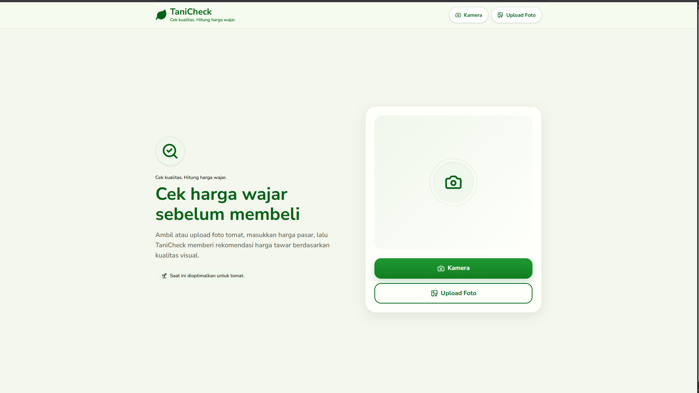
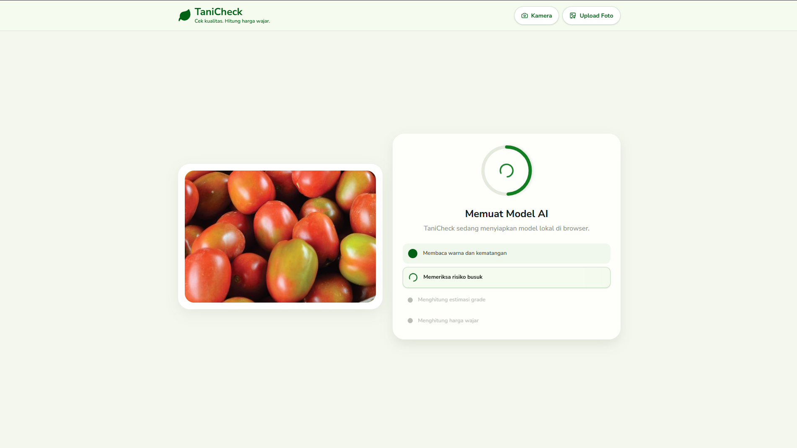
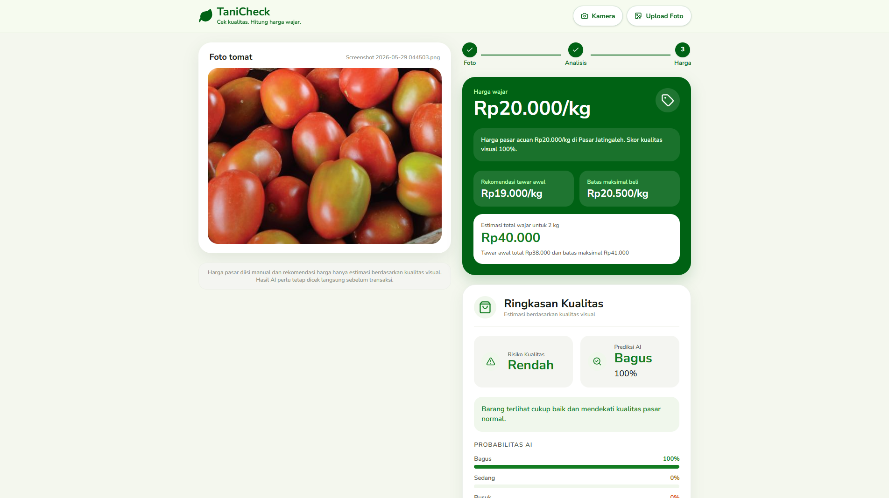
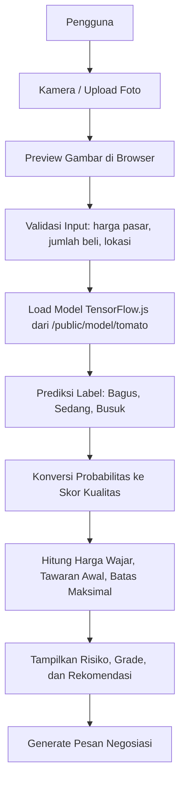
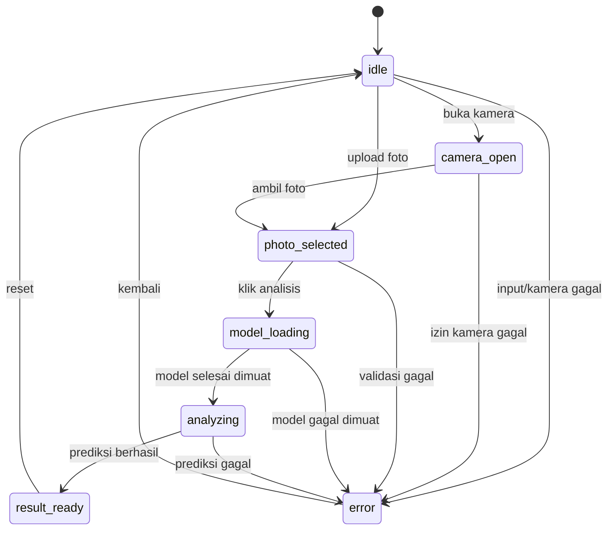

# TaniCheck

TaniCheck adalah aplikasi web berbasis AI untuk membantu pengguna mengecek kualitas visual tomat dari foto, lalu mengubah hasil klasifikasi tersebut menjadi rekomendasi harga tawar yang lebih mudah dipahami.

Proyek ini dibuat sebagai prototype awal. Fokus model AI saat ini masih terbatas pada komoditas tomat dengan tiga label kualitas: `Bagus`, `Sedang`, dan `Busuk`.

## Tampilan Aplikasi

### Tampilan Awal



### Proses Analisis AI



### Hasil Rekomendasi



## Tujuan Produk

Dalam transaksi hasil panen, kualitas visual barang sering memengaruhi harga akhir. Namun, penilaian kualitas masih sering subjektif dan sangat bergantung pada pengalaman pembeli atau pedagang.

TaniCheck mencoba menjembatani masalah tersebut dengan alur sederhana:

1. Pengguna mengambil atau mengunggah foto tomat.
2. Pengguna memasukkan harga pasar, jumlah pembelian, dan lokasi pasar.
3. Model AI memprediksi kualitas visual tomat.
4. Sistem menghitung harga wajar, tawaran awal, batas maksimal beli, risiko kualitas, estimasi grade, dan pesan negosiasi.

## Fitur Utama

- Kamera langsung menggunakan `navigator.mediaDevices.getUserMedia`.
- Upload foto dari perangkat.
- Validasi file gambar dan ukuran maksimal 8 MB.
- Preview foto sebelum analisis.
- Model klasifikasi gambar berjalan langsung di browser.
- Tiga label kualitas: `Bagus`, `Sedang`, `Busuk`.
- Perhitungan skor kualitas berdasarkan probabilitas model.
- Rekomendasi harga wajar per kilogram.
- Estimasi total harga berdasarkan jumlah pembelian.
- Tawaran awal dan batas maksimal beli.
- Risiko kualitas: `Rendah`, `Sedang`, atau `Tinggi`.
- Estimasi grade A, B, dan C.
- Pesan negosiasi otomatis yang dapat disalin.
- UI responsif dengan pendekatan mobile-first.

## Tech Stack

| Kategori | Teknologi | Keterangan |
|---|---|---|
| Framework | Next.js | Framework React untuk aplikasi web, routing, build, dan deployment-friendly workflow. |
| UI Library | React | Membangun antarmuka interaktif berbasis komponen. |
| Bahasa | TypeScript | Memberi type-safety untuk state, hasil prediksi, dan perhitungan harga. |
| Styling | Tailwind CSS | Utility-first styling untuk membangun UI responsif dengan cepat. |
| AI Runtime | TensorFlow.js | Menjalankan model machine learning langsung di browser. |
| Model Helper | `@teachablemachine/image` | Memuat model Teachable Machine dan melakukan prediksi gambar. |
| Icon | Lucide React + SVG custom | Lucide dipakai untuk ikon UI, sedangkan logo daun TaniCheck memakai SVG custom. |
| Deployment | Vercel | Platform deployment yang terintegrasi baik dengan Next.js. |

## Alasan Pemilihan Teknologi

### Next.js

Next.js dipilih karena cocok untuk prototype aplikasi web yang tetap punya jalur produksi jelas. Walaupun TaniCheck saat ini berisi satu halaman utama, Next.js memberi beberapa keuntungan teknis:

- Struktur proyek rapi untuk React + TypeScript.
- Build dan optimasi aset sudah terintegrasi.
- Mudah dikembangkan menjadi aplikasi multi-halaman jika nanti ada dashboard, riwayat analisis, atau halaman dataset.
- Integrasi deployment ke Vercel sangat sederhana.
- Mendukung pola client-side interactivity yang dibutuhkan untuk kamera, upload gambar, dan inferensi model di browser.

Tradeoff:

- Untuk aplikasi satu halaman yang sangat kecil, Next.js lebih berat dibanding Vite atau HTML statis.
- Beberapa fitur Next.js seperti server rendering belum banyak dimanfaatkan karena inferensi AI dan kamera harus berjalan di sisi client.
- Build toolchain lebih kompleks dibanding aplikasi React minimal.

### Vercel

Vercel dipilih karena workflow deployment Next.js sangat langsung dan cocok untuk demonstrasi prototype:

- Deploy cepat dari project Next.js.
- Hosting statis dan aset model dapat dilayani dari folder `public`.
- URL demo mudah dibagikan.
- Cocok untuk presentasi, validasi pengguna, dan pengujian lintas perangkat.

Tradeoff:

- Jika model AI bertambah besar, ukuran aset statis dapat memengaruhi waktu load awal.
- Jika nanti butuh backend berat, database, autentikasi kompleks, atau job asynchronous, arsitektur perlu ditambah dengan service lain.
- Model yang disimpan di `public` dapat diakses publik, sehingga bukan tempat untuk model proprietary yang sensitif.

### TensorFlow.js

TensorFlow.js digunakan agar model dapat berjalan langsung di browser pengguna tanpa backend inference server.

Alasan teknis:

- Privasi lebih baik karena foto tidak perlu dikirim ke server untuk prediksi.
- Latensi bisa rendah setelah model selesai dimuat.
- Cocok untuk demo dan prototype karena tidak perlu menyiapkan server AI.
- Dapat bekerja dengan model hasil export dari Google Teachable Machine.

Tradeoff:

- Waktu muat awal bertambah karena browser harus mengunduh `model.json`, `metadata.json`, dan `weights.bin`.
- Performa inferensi bergantung pada perangkat pengguna.
- Model kecil cocok untuk prototype, tetapi untuk model lebih kompleks mungkin perlu optimasi atau backend inference.
- Akurasi sangat bergantung pada dataset, pencahayaan foto, sudut pengambilan gambar, dan variasi kondisi tomat.

### Google Teachable Machine

Google Teachable Machine dipilih untuk mempercepat pembuatan prototype klasifikasi gambar. Model dapat dilatih dan diekspor ke format TensorFlow.js tanpa pipeline training yang rumit.

Tradeoff:

- Kontrol training lebih terbatas dibanding pipeline custom dengan TensorFlow/Keras atau PyTorch.
- Sulit melakukan eksperimen lanjutan seperti augmentasi kompleks, evaluasi metrik mendalam, dan versioning model yang rapi.
- Cocok untuk validasi konsep, tetapi bukan pilihan final jika produk membutuhkan akurasi tinggi dan dataset besar.

## Arsitektur Aplikasi

TaniCheck saat ini memakai arsitektur client-heavy. Semua proses utama berjalan di browser:

- Pengambilan gambar.
- Validasi input.
- Load model AI.
- Prediksi kualitas.
- Perhitungan harga.
- Penyusunan pesan negosiasi.



## Alur State Aplikasi

State utama aplikasi dikelola di sisi client melalui React state. Alur layar dibuat eksplisit agar mudah dipahami dan diuji.



## Struktur Folder Penting

```text
.
|-- app/
|   |-- page.tsx          # Route utama / yang me-render TaniCheckPage
|   |-- layout.tsx        # Layout root Next.js
|   |-- icon.svg          # Favicon/logo daun TaniCheck
|   `-- globals.css       # Token warna, font, dan animasi global
|-- src/
|   `-- features/
|       `-- tanicheck/
|           |-- TaniCheckPage.tsx      # State utama dan orchestration flow aplikasi
|           |-- constants.ts           # Konstanta model, batas file, label, dan langkah analisis
|           |-- types.ts               # Type untuk state, prediksi, tone, model, dan hasil harga
|           |-- components/
|           |   |-- AppHeader.tsx
|           |   |-- AppShell.tsx
|           |   |-- BottomNav.tsx
|           |   |-- HomeScreen.tsx
|           |   |-- CameraScreen.tsx
|           |   |-- PhotoSelectedScreen.tsx
|           |   |-- AnalysisScreen.tsx
|           |   |-- ResultScreen.tsx
|           |   |-- ErrorScreen.tsx
|           |   `-- shared-ui.tsx
|           `-- lib/
|               |-- formatting.ts       # Format Rupiah, persen, dan teks pesan
|               |-- model.ts            # Load model dan gambar prediksi
|               |-- pricing.ts          # Kalkulasi harga, risiko, grade, dan label prediksi
|               `-- validation.ts       # Validasi file gambar dan input transaksi
|-- public/
|   `-- model/
|       `-- tomato/
|           |-- model.json
|           |-- metadata.json
|           `-- weights.bin
|-- website-desktop.png   # Screenshot tampilan awal
|-- analisis-ai.png       # Screenshot proses analisis
|-- hasil-ai.png          # Screenshot hasil rekomendasi
|-- package.json
`-- README.md
```

## Model AI

Model berada di:

```text
public/model/tomato/
```

File model:

- `model.json`: graph/model configuration untuk TensorFlow.js.
- `metadata.json`: metadata Teachable Machine, termasuk label dan ukuran input.
- `weights.bin`: bobot model.

Metadata saat ini:

| Properti | Nilai |
|---|---|
| Model | `tm-my-image-model` |
| Package | `@teachablemachine/image` |
| Label | `Bagus`, `Sedang`, `Busuk` |
| Ukuran input | `224 x 224` |
| Komoditas prototype | Tomat |

Model hanya difokuskan pada tomat karena tujuan tahap awal adalah membuktikan alur end-to-end: foto masuk, kualitas diprediksi, lalu hasil prediksi diterjemahkan menjadi rekomendasi harga. Membatasi komoditas membuat dataset lebih mudah dikontrol dan memudahkan evaluasi awal.

Untuk tahap lanjutan, model dapat diperluas ke komoditas lain seperti cabai, bawang, kentang, apel, atau buah-buahan lain. Ekspansi tersebut sebaiknya dilakukan setelah dataset lebih besar dan proses evaluasi model lebih matang.

## Cara Kerja Prediksi

Saat pengguna menekan tombol analisis:

1. Aplikasi memastikan foto sudah siap dibaca.
2. Aplikasi memuat TensorFlow.js secara dinamis.
3. Aplikasi memuat model dari:

   ```text
   /model/tomato/model.json
   /model/tomato/metadata.json
   ```

4. Model menghasilkan probabilitas untuk setiap label.
5. Label dengan probabilitas tertinggi dipakai sebagai prediksi utama.
6. Probabilitas semua label tetap digunakan untuk menghitung skor kualitas.

## Formula Rekomendasi Harga

Perhitungan harga dilakukan di browser setelah prediksi AI selesai.

### Skor Kualitas

```text
skor_kualitas =
  probabilitas_Bagus  x 1.0 +
  probabilitas_Sedang x 0.7 +
  probabilitas_Busuk  x 0.3
```

Bobot tersebut dipilih agar kualitas `Bagus` mempertahankan harga mendekati harga pasar, `Sedang` memberi diskon moderat, dan `Busuk` memberi penalti besar.

### Harga Wajar

```text
harga_wajar = harga_pasar x skor_kualitas
```

### Tawaran Awal

```text
tawaran_awal = harga_wajar x 0.95
```

### Batas Maksimal Beli

```text
batas_maksimal_beli = harga_wajar x 1.03
```

### Pembulatan Harga

Harga dibulatkan agar lebih realistis untuk transaksi:

- Harga di atas atau sama dengan Rp10.000 dibulatkan ke kelipatan Rp500.
- Harga di bawah Rp10.000 dibulatkan ke kelipatan Rp100.

## Klasifikasi Risiko

Risiko kualitas ditentukan dari probabilitas `Sedang` dan `Busuk`.

| Kondisi | Risiko | Penjelasan |
|---|---|---|
| `Busuk >= 0.55` | Tinggi | Ada indikasi busuk dominan, harga pasar penuh tidak disarankan. |
| `Sedang >= 0.45` atau `Busuk >= 0.25` | Sedang | Barang masih bisa dibeli, tetapi perlu ditawar. |
| Selain itu | Rendah | Barang relatif mendekati kualitas pasar normal. |

## Estimasi Grade

Selain label utama, TaniCheck menghitung estimasi grade:

- Grade A: kualitas premium.
- Grade B: kualitas standar.
- Grade C: perlu diskon.

Grade dihitung dari kombinasi probabilitas model. Nilai ini bersifat estimasi visual, bukan standar mutu resmi.

## Instalasi dan Menjalankan Lokal

Pastikan Node.js sudah terpasang.

```bash
npm install
npm run dev
```

Buka aplikasi di:

```text
http://localhost:3000
```

Build production:

```bash
npm run build
npm run start
```

Lint:

```bash
npm run lint
```

## Batasan Prototype

- Model hanya mendukung tomat.
- Akurasi belum dapat dianggap final tanpa evaluasi dataset uji yang lebih besar.
- Kualitas prediksi dipengaruhi pencahayaan, blur, sudut foto, latar belakang, dan variasi tomat.
- Harga pasar masih diisi manual oleh pengguna.
- Formula harga masih sederhana dan belum mempertimbangkan varietas, ukuran, musim, lokasi detail, volume pasokan, atau permintaan pasar.
- Model berjalan di browser, sehingga performa bergantung pada perangkat pengguna.
- Aset model berada di folder publik, sehingga tidak cocok untuk model yang bersifat rahasia.

## Tradeoff Desain Sistem

| Keputusan | Kelebihan | Tradeoff |
|---|---|---|
| Inferensi di browser | Privasi lebih baik, tidak perlu server AI, latensi rendah setelah model load. | Load awal lebih besar dan performa tergantung perangkat. |
| Model Teachable Machine | Cepat untuk prototype dan mudah diekspor ke TensorFlow.js. | Kontrol training dan evaluasi terbatas. |
| Fokus tomat | Dataset lebih mudah dikontrol dan validasi awal lebih fokus. | Belum bisa dipakai untuk semua sayur/buah. |
| Harga pasar manual | Sederhana dan fleksibel untuk demo. | Pengguna perlu tahu harga pasar sendiri. |
| Next.js | Struktur production-ready dan mudah deploy ke Vercel. | Lebih kompleks dibanding React/Vite sederhana untuk satu halaman. |
| Vercel | Deployment cepat dan URL demo mudah dibagikan. | Untuk kebutuhan backend/AI lebih kompleks mungkin perlu layanan tambahan. |

## Roadmap Pengembangan

Prioritas teknis berikutnya:

- Menambah dataset tomat dengan variasi pencahayaan, sudut, ukuran, dan kondisi.
- Membuat dataset uji terpisah untuk mengukur akurasi, precision, recall, dan confusion matrix.
- Menambahkan model untuk komoditas lain.
- Membuat selector komoditas sebelum analisis.
- Menyimpan riwayat analisis di database.
- Mengambil harga pasar dari API atau sumber data lokal.
- Menambahkan mode PWA/offline agar lebih cocok dipakai di lapangan.
- Mengoptimasi ukuran model agar load awal lebih cepat.
- Menambahkan fallback jika perangkat tidak mendukung kamera.
- Menambahkan pengujian otomatis untuk fungsi perhitungan harga.

## Catatan Pengembangan

Route utama tetap berada di `app/page.tsx`, tetapi file tersebut hanya menjadi entry point untuk halaman `/`. Kode aplikasi TaniCheck sudah dipisah ke `src/features/tanicheck/` agar state flow, komponen UI, dan fungsi domain lebih mudah dirawat.

Beberapa bagian kode penting:

- `src/features/tanicheck/TaniCheckPage.tsx`: mengelola state utama, kamera, upload foto, alur analisis, reset, dan copy pesan negosiasi.
- `src/features/tanicheck/lib/model.ts`: memuat TensorFlow.js, model Teachable Machine, dan gambar prediksi.
- `src/features/tanicheck/lib/pricing.ts`: mengubah probabilitas model menjadi risiko, grade, dan rekomendasi harga.
- `src/features/tanicheck/lib/validation.ts`: memvalidasi file gambar, harga pasar, jumlah beli, dan lokasi pasar.
- `src/features/tanicheck/components/`: berisi screen dan komponen UI untuk home, kamera, preview foto, proses analisis, hasil, error, header, dan navigasi bawah.

## Lisensi

Prototype ini belum mendefinisikan lisensi publik. Jika akan dipublikasikan untuk kolaborasi luas, tambahkan file `LICENSE` terlebih dahulu.
